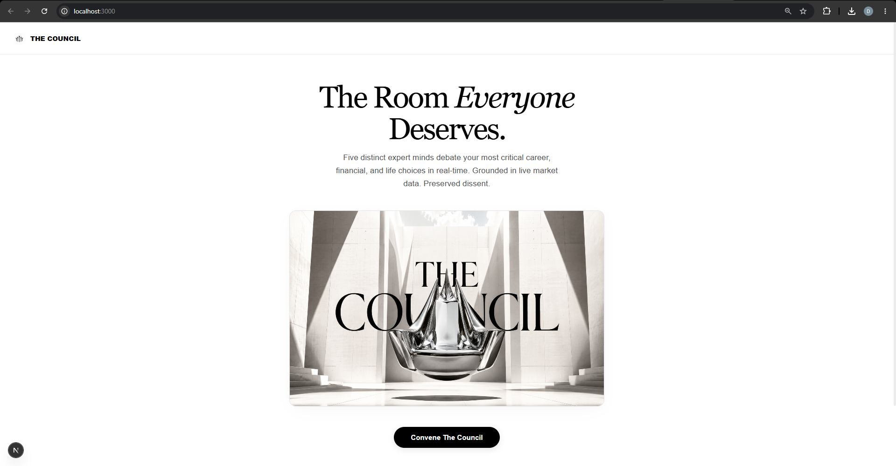
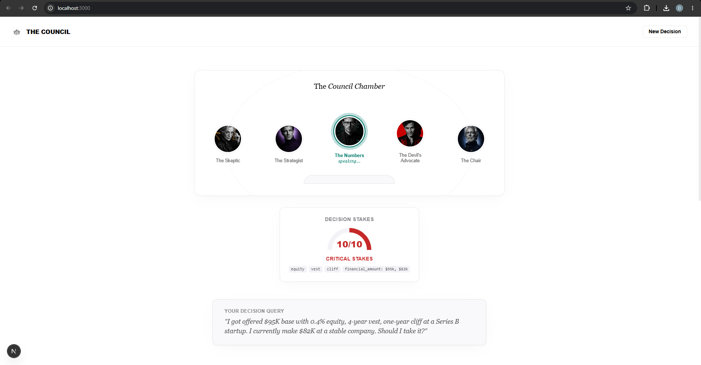
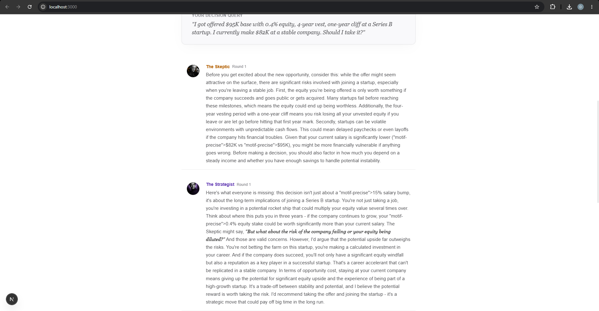

<div align="center">

# 🏛️ THE COUNCIL

### *Expert Advisors Who Fight For Your Decision*

**Five AI minds with distinct personalities debate your most important life decisions in real-time — then deliver a verdict with preserved dissent, grounded in live market data.**

[](https://band.ai)
[](https://featherless.ai)
[](https://aimlapi.com)
[](https://brightdata.com)

<br/>

[🎬 Watch Demo](#demo) · [🚀 Quick Start](#quick-start) · [🏗️ Architecture](#architecture) · [🧠 How It Works](#how-it-works)

</div>

---

<div align="center">



*"The Room Everyone Deserves."*

</div>

---

## 💡 The Problem

**Everyone faces life-changing decisions alone.**

Should I take this job offer? Is this startup equity worth the risk? Should I move across the country? Should I go back to school?

Today, people turn to friends who don't have context, Reddit threads written by strangers, or their own anxiety-fueled 3am thoughts. The stakes are enormous. The support system is broken.

**What if you had a room of five brilliant advisors — each with a different perspective — who fought *for* you?**

---

## ✨ The Solution

**THE COUNCIL** gives every person access to the advisory board that only executives have.

Five AI advisors with distinct, persistent personalities debate your decision in real-time. They argue. They disagree. They challenge each other. Then the Chair synthesizes everything into a clear verdict — with the minority opinion *preserved and honored*, never silenced.

This isn't a chatbot. This is a **deliberation system** with structured debate, cryptographic verdict integrity, and live market data grounding.

<div align="center">



*The Council Chamber — five advisors with distinct roles, visible convergence tracking, and real-time stakes classification*

</div>

---

## 🎭 Meet The Advisors

| Advisor | Role | Personality | Model |
|---------|------|-------------|-------|
| 🔍 **The Skeptic** | Risk Analyst | Finds the hidden costs, the traps, the fine print. Protective, not negative. | `Qwen/Qwen3.5` via Featherless |
| 📈 **The Strategist** | Long-Term Thinker | Sees doors opening in 2, 5, 10 years. Visionary and bold. | `Llama-4-Maverick-17B` via Featherless |
| 🧮 **The Numbers** | Quantitative Analyst | Cuts through emotion with data. Calculates, compares, grounds in evidence. | `DeepSeek-R1-70B` via Featherless |
| 😈 **The Devil's Advocate** | Consensus Challenger | Takes the opposite position. Forces the group to *earn* their conclusion. | `Llama-4-Scout-17B` via Featherless |
| ⚖️ **The Chair** | Final Arbiter | Listens to all, weighs arguments, delivers the verdict with preserved dissent. | `GPT-4o-mini` via AI/ML API |

> **Each advisor runs as an independent Band.ai remote agent** with its own LLM, personality, and communication style. They are not prompts — they are autonomous participants in a shared deliberation room.

---

## 🔥 Key Features

### 🎪 Live Multi-Agent Debate
Five advisors argue in real-time via Band.ai rooms. Watch perspectives clash, evolve, and crystallize — streamed live to the browser via WebSocket.

### ⚖️ Preserved Dissent (Stare Decisis)
Inspired by Supreme Court tradition: minority opinions are **cryptographically hashed** and permanently stored alongside the majority verdict. Dissent is never deleted. Every voice matters.

### 📊 Stakes Classification Engine
A deterministic classifier analyzes your decision's category (career, financial, relationship, health, education, housing), severity (1-10), and risk factors — *before* the AI even begins debating. No LLM involved.

### 🔗 Tamper-Evident Verdict Chain
Every verdict is SHA-256 hashed and chained to the previous one. If any verdict is modified after the fact, the chain breaks. Integrity you can verify.

### 📈 Live Market Data Grounding
For career and financial decisions, Brightdata fetches real-time salary benchmarks and market data. The Numbers advisor doesn't hallucinate compensation figures — they cite them.

### 🎯 Convergence Tracking
A real-time convergence meter shows how much the advisors agree or disagree. High convergence (>0.7) = strong consensus. Low convergence (<0.3) = the council is deeply divided.

<div align="center">



*Live debate stream — each advisor presents their analysis with distinct voice and reasoning style*

</div>

---

## 🏗️ Architecture

```
┌─────────────────────────────────────────────────────────────────────┐
│                        THE COUNCIL SYSTEM                           │
│                                                                     │
│   ┌──────────────┐     ┌───────────────┐     ┌──────────────────┐  │
│   │   FRONTEND    │◄───►│    BACKEND     │◄───►│    BAND.AI       │  │
│   │   Next.js 16  │     │   FastAPI      │     │   Agent Mesh     │  │
│   │               │     │               │     │                  │  │
│   │  • Hero Page  │     │  • REST API   │     │  • 5 Advisors    │  │
│   │  • Chamber    │     │  • WebSocket  │     │  • Room Mgmt     │  │
│   │  • Verdict    │     │  • SQLite DB  │     │  • @mention       │  │
│   └──────────────┘     └───────┬───────┘     └──────┬───────────┘  │
│                                │                     │              │
│                  ┌─────────────┴────────┐   ┌───────┴───────────┐  │
│                  │  DETERMINISTIC       │   │  LLM PROVIDERS    │  │
│                  │  ENGINE              │   │                   │  │
│                  │                      │   │  Featherless AI   │  │
│                  │  • Stakes Classifier │   │  (4 advisors)     │  │
│                  │  • Convergence Calc  │   │                   │  │
│                  │  • Dissent Logger    │   │  AI/ML API        │  │
│                  │  • SHA-256 Hash      │   │  (The Chair)      │  │
│                  │    Chain             │   │                   │  │
│                  └──────────────────────┘   └───────────────────┘  │
│                                                                     │
│   ┌─────────────────────────────────────────────────────────────┐   │
│   │                      BRIGHTDATA                              │   │
│   │    Live salary & market data grounding during debate         │   │
│   └─────────────────────────────────────────────────────────────┘   │
└─────────────────────────────────────────────────────────────────────┘
```

---

## 🧠 How It Works

```
  User submits a decision
          │
          ▼
  ┌─────────────────────┐
  │  Stakes Classifier   │ ──→  Category + Stakes Level (1-10) + Risk Factors
  │  (no AI involved)    │      Deterministic keyword + pattern analysis
  └──────────┬──────────┘
             │
             ▼
  ┌─────────────────────┐
  │  Brightdata Query    │ ──→  Real-time salary/market data (career/financial)
  │  (if applicable)     │      Stored as evidence in SQLite
  └──────────┬──────────┘
             │
             ▼
  ┌───────────────────────────────────────────────────────┐
  │              BAND.AI ROOM DEBATE                       │
  │                                                        │
  │  Round 1: Initial Positions                           │
  │  ├─ The Skeptic    → Identifies risks & hidden costs  │
  │  ├─ The Strategist → Maps long-term opportunities     │
  │  ├─ The Numbers    → Quantifies with market data      │
  │  └─ The Devil's Advocate → Challenges consensus       │
  │                                                        │
  │  Round 2: Cross-Examination                           │
  │  └─ Advisors respond to each other's arguments        │
  │                                                        │
  │  Round 3: The Verdict                                 │
  │  └─ The Chair synthesizes all arguments               │
  └──────────────────┬────────────────────────────────────┘
                     │
                     ▼
  ┌─────────────────────┐
  │  Post-Processing     │
  │  • Convergence score │ ──→  How much did they agree? (0.0–1.0)
  │  • Dissent extraction│ ──→  Minority opinion preserved with hash
  │  • SHA-256 chain     │ ──→  Verdict linked to previous verdicts
  │  • Action items      │ ──→  3 concrete next steps
  └─────────────────────┘
```

---

## 🗃️ Data Model

**6 tables** — designed for full deliberation traceability:

| Table | Purpose | Key Fields |
|-------|---------|------------|
| `decisions` | User's original query | `input_text`, `category`, `stakes_level`, `status` |
| `advisors` | The five council members | `name`, `role`, `model`, `provider`, `personality` |
| `arguments` | Every point made in debate | `content`, `position` (for/against/nuanced), `round` |
| `verdicts` | The Chair's final ruling | `recommendation`, `confidence`, `hash`, `prev_hash` |
| `dissents` | Preserved minority opinions | `dissent_content`, `hash` (linked to verdict) |
| `evidence` | Market data from Brightdata | `source`, `data_type`, `content` (JSON) |

---

## 🔌 Sponsor Integration Depth

This project was architected around the hackathon's sponsor technologies — not as badges, but as **load-bearing pillars**:

| Sponsor | Depth | How It's Used |
|---------|-------|---------------|
| **Band.ai** | ⬛⬛⬛⬛⬛ L5 | **THE CORE.** All 5 advisors are Band remote agents. Debate happens in Band rooms. @mention routing, participant management, real-time messaging — all Band. Remove Band and the product *ceases to exist.* |
| **Featherless AI** | ⬛⬛⬛⬛◻ L4 | 4 of 5 advisors run on Featherless models. Different models for different personalities: Qwen3.5 (analytical), Llama-4-Maverick (strategic), DeepSeek-R1 (quantitative), Llama-4-Scout (provocative). Genuine model diversity, not one model with different prompts. |
| **AI/ML API** | ⬛⬛⬛⬛◻ L4 | The Chair — the most critical advisor — runs on GPT-4o-mini via AI/ML API. Verdict synthesis requires the highest-quality reasoning. The arbiter *earns* the best model. |
| **Brightdata** | ⬛⬛⬛◻◻ L3 | Real-time salary and market data grounding. Career decisions trigger Brightdata scraping so The Numbers advisor cites *real compensation ranges*, not LLM confabulation. Graceful fallback to static benchmarks. |

---

## 🚀 Quick Start

### Prerequisites

- **Python 3.10+** and **Node.js 18+**
- API keys for: [Band.ai](https://app.band.ai), [Featherless AI](https://featherless.ai), [AI/ML API](https://aimlapi.com), [Brightdata](https://brightdata.com) (optional)

### 1. Clone & Configure

```bash
git clone https://github.com/Shreekumar-Shah-AICTE/Band-of-Agents-Hackathon.git
cd Band-of-Agents-Hackathon

# Copy the environment template and fill in your API keys
cp .env.template .env.local
```

### 2. Backend Setup

```bash
cd backend
pip install -r requirements.txt
cd ..
```

### 3. Frontend Setup

```bash
cd frontend
npm install
cd ..
```

### 4. Launch

**Terminal 1 — Backend:**
```bash
cd backend
python main.py
# FastAPI server starts on http://localhost:8000
```

**Terminal 2 — Frontend:**
```bash
cd frontend
npm run dev
# Next.js starts on http://localhost:3000
```

### 5. Try It

Open `http://localhost:3000` and submit a decision:

> *"I got offered $95K base with 0.4% equity, 4-year vest, one-year cliff at a Series B startup. I currently make $82K at a stable company. Should I take it?"*

Watch five advisors fight about your future. Receive a verdict. Read the dissent. Take action.

---

## 🎬 Demo

### Judge's Quick-Start Flow

1. **Open the app** → See the editorial hero section: *"The Room Everyone Deserves."*
2. **Click "Convene The Council"** → Enter the Council Chamber
3. **Paste a real decision** → (Use the example above, or your own)
4. **Watch the debate unfold** → Advisors appear one by one with distinct voices
5. **Read the verdict** → Clear recommendation + preserved dissent + 3 action items
6. **Check the technical depth** → Stakes classifier, convergence meter, hash chain visible in UI

### What Makes This Different

| Typical AI Hackathon Project | THE COUNCIL |
|------------------------------|-------------|
| Single chatbot with one prompt | 5 autonomous agents with distinct models |
| Generic "ask me anything" | Structured deliberation with rounds |
| Response disappears after chat | Verdicts hashed into tamper-evident chain |
| AI-only logic | Deterministic engine (stakes, convergence, hashing) independent of AI |
| No data grounding | Live market data via Brightdata |
| One LLM provider | 4 different models across 2 providers |

---

## 📁 Project Structure

```
Band-of-Agents-Hackathon/
├── README.md                       ← You are here
├── ARCHITECTURE.md                 ← Full technical specification
├── DESIGN.md                       ← Visual design system documentation
├── .env.template                   ← Environment variable template
│
├── backend/                        ← Python (FastAPI + Band SDK)
│   ├── main.py                     ← Server entry point + debate orchestrator
│   ├── config.py                   ← Environment & configuration
│   ├── requirements.txt
│   ├── run_agents.py               ← Launch all 5 Band agents
│   │
│   ├── agents/                     ← Band.ai remote agent definitions
│   │   ├── skeptic.py              ← 🔍 The Skeptic (Qwen3.5)
│   │   ├── strategist.py           ← 📈 The Strategist (Llama-4-Maverick)
│   │   ├── numbers.py              ← 🧮 The Numbers (DeepSeek-R1-70B)
│   │   ├── devils_advocate.py      ← 😈 The Devil's Advocate (Llama-4-Scout)
│   │   └── chair.py                ← ⚖️ The Chair (GPT-4o-mini)
│   │
│   ├── engine/                     ← Deterministic logic (zero AI)
│   │   ├── stakes_classifier.py    ← Decision categorization & severity
│   │   ├── convergence.py          ← Advisor agreement scoring
│   │   ├── dissent_logger.py       ← Minority opinion preservation
│   │   └── hash_chain.py           ← SHA-256 verdict integrity chain
│   │
│   ├── database/                   ← SQLite persistence
│   │   └── models.py               ← Schema: 6 tables
│   │
│   └── integrations/               ← External services
│       ├── llm_router.py           ← Multi-provider LLM routing
│       └── brightdata.py           ← Market data scraping + fallback
│
├── frontend/                       ← Next.js 16 (React 19)
│   └── src/
│       ├── app/
│       │   ├── page.js             ← Editorial hero landing page
│       │   ├── council/page.js     ← The Council Chamber experience
│       │   ├── layout.js           ← Root layout with custom typography
│       │   └── globals.css         ← Full design system (CSS custom properties)
│       │
│       └── components/
│           ├── HeroSection.js      ← Apple-inspired editorial hero
│           ├── DecisionInput.js    ← Decision submission form
│           ├── CouncilChamber.js   ← Live debate visualization
│           ├── DebateStream.js     ← Real-time advisor message stream
│           ├── VerdictPanel.js     ← Verdict + dissent display
│           ├── StakesIndicator.js  ← Visual stakes gauge
│           └── ConvergenceMeter.js ← Advisor agreement visualization
│
└── docs/images/                    ← README screenshots
```

---

## 🎨 Design Philosophy

The UI deliberately breaks from the typical dark-mode hackathon aesthetic. Inspired by **Apple product pages** and **editorial design**:

- **Stark white backgrounds** with generous whitespace
- **Playfair Display** for headings (editorial gravitas) + **Inter** for body (clean readability)
- **Italic motifs** for emphasis — *"The Room Everyone Deserves."*
- **Monochromatic advisor portraits** with colored accent glows
- **No gradients, no neon** — confidence through restraint
- **Responsive** — works on mobile, designed for desktop

---

## 🛠️ Tech Stack

| Layer | Technology | Purpose |
|-------|-----------|---------|
| **Agent Orchestration** | Band.ai SDK | Remote agent mesh, room management, @mention routing |
| **Backend** | Python + FastAPI | REST API, WebSocket streaming, debate orchestration |
| **Frontend** | Next.js 16 + React 19 | Server components, editorial UI, real-time updates |
| **Database** | SQLite | 6-table schema for full deliberation persistence |
| **LLM (4 advisors)** | Featherless AI | Qwen3.5, Llama-4-Maverick, DeepSeek-R1-70B, Llama-4-Scout |
| **LLM (The Chair)** | AI/ML API | GPT-4o-mini for verdict synthesis |
| **Market Data** | Brightdata | Real-time salary/compensation benchmarking |
| **Integrity** | SHA-256 Hash Chain | Tamper-evident verdict + dissent linking |

---

## 🧪 Technical Differentiators

### Non-AI Custom Logic (Remove AI → System Still Functions)

1. **Stakes Classifier** — Keyword + pattern-based decision categorization with severity scoring. Zero LLM calls.
2. **Convergence Calculator** — Position agreement (60%) + content similarity (40%) weighted scoring across all advisor arguments.
3. **SHA-256 Hash Chain** — Every verdict is cryptographically linked to its predecessor. Every dissent is hashed to its verdict.
4. **Dissent Extractor** — Parses the Chair's structured output to identify, attribute, and persist minority opinions.

### Multi-Model Architecture

Each advisor uses a **different LLM** selected for its reasoning profile:
- **Qwen3.5** → Analytical, precise (The Skeptic)
- **Llama-4-Maverick** → Creative, strategic (The Strategist)
- **DeepSeek-R1-70B** → Quantitative, data-driven (The Numbers)
- **Llama-4-Scout** → Provocative, contrarian (The Devil's Advocate)
- **GPT-4o-mini** → Balanced, synthesis-capable (The Chair)

This isn't one model wearing five hats. It's five minds in a room.

---

## 👨‍💻 Built By

**Shree Shah** — Solo builder

Built in one session for the [Band of Agents Hackathon](https://lablab.ai) on lablab.ai.

---

<div align="center">

*Five advisors. One room. Your decision.*

**The Council is always in session.**

---

*Built with conviction. Designed for Rank 1.*

</div>
